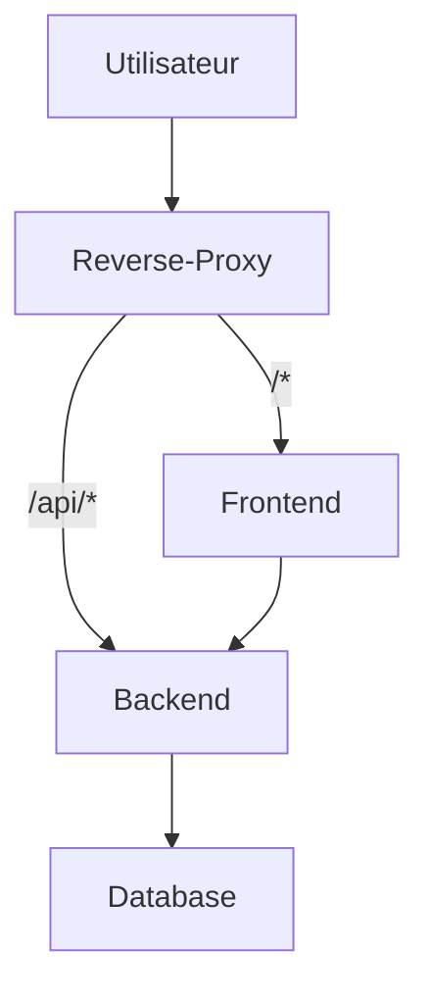
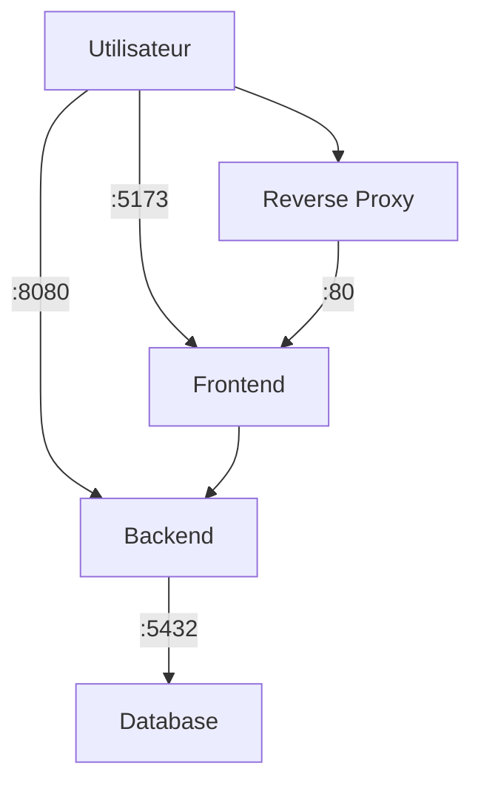

# Projet Docker (Full stack)

## 1. Architecture globale

Services Docker (réseau `app-net`) :

- `db` — Postgres 18 (volume `pgdata` pour la persistance)
- `api` — Spring Boot (port interne 8080)
- `webapp` — React construit par Vite, servi par Nginx
- `proxy` — Nginx reverse-proxy qui sert le front sur `/` et route l'API sur `/api/*` → `api:8080`

Schéma (simplifié):

### Architecture de production


### Architecture de développement


## 2. Commandes pour builder et lancer

En PowerShell, à la racine du repo.

- Dev (avec override: publie aussi 4200 et 5432) :
```powershell
docker-compose up --build -d
```
- Prod-like (sans override: seulement 80 exposé) :
```powershell
docker-compose -f docker-compose.yml up --build -d
```
- Arrêt :
```powershell
docker-compose down
```
- Logs utiles :
```powershell
docker-compose logs -f proxy
docker-compose logs -f api
docker-compose logs -f db
```

## 3. Endpoints API + URL frontend

- Frontend (dev): `http://localhost:4200`
- Frontend (prod-like): `http://localhost`
- API via proxy: `http://localhost/api/*`
- API directe (dev): `http://localhost:8080/api/*`

Endpoints fournis par l’API:

| Méthode | Endpoint | Description |
|---------|----------|-------------|
| GET | `/api/health` | Statut de l’API (`{"status":"ok"}`) |
| GET | `/api/items` | Liste des items |
| POST | `/api/items` | Crée un item. Corps: `{ "name": "<string>" }` |

Exemples rapides:
```powershell
curl http://localhost:4200/api/health
curl http://localhost:8080/api/health
curl -X POST http://localhost:4200/api/items -H "Content-Type: application/json" -d '{"name":"Demo"}'
```

## 4. Problèmes rencontrés et solutions

- Front en 4200 ne “voyait” pas l’API → les requêtes partaient en `/api/api/*` (doublon).
	- Cause: le code front construit `API_BASE + "/api/..."` et `API_BASE` valait déjà `/api`.
	- Solution: en dev, on build le front avec `VITE_API_BASE_URL = .` (valeur relative). Les fetch deviennent `./api/...` → le proxy les résout en `/api/...` sans doublon.
- Différence dev/prod peu claire (deux URLs qui marchent).
	- Choix: en dev, on expose à la fois `80:80` et `4200:80` sur le `proxy` pour le confort. En prod-like, seul `80:80` est exposé.
- Accès DB depuis l’hôte en dev.
	- Ajout dans l’override: `db` publie `5432:5432`. Connexion: `localhost:5432` avec les variables `POSTGRES_*`.
- Rédacrion du Dockerfile front multi-stage pour builder l'application React avec Node.js puis servir les fichiers statiques avec Nginx.
	- Apres quelques essais, le dockerfile a été amelioré afin qu'il soit fonctionnel et optimisé grace a la separation des phases build et runtime, avec la partie node et la partie nginx.
## 5. Choix techniques effectués

- Reverse proxy Nginx devant le front et l’API: une seule origine côté navigateur; pas de CORS; URLs simples (`/` et `/api`).
- Front servi statiquement par Nginx (build Vite) pour des déploiements simples et rapides.
- `VITE_API_BASE_URL='.'` au build: évite le couplage à des URLs absolues; compatible dev/prod sans changer le code.
- Healthchecks:
	- `api` a un healthcheck sur `/api/health` avec `start_period` pour laisser démarrer Spring.
	- `proxy` et `webapp` ont un healthcheck simple. Non obligatoire, mais pratique pour `depends_on: condition: service_healthy`.
- Compose override pour le “mode dev”:
	- Publie `4200:80` (en plus de `80:80`) et `5432:5432`.
	- N’ouvre pas la DB en prod-like (sécurité).
- Images taguées `backend:1.0` et `frontend:1.0` pour lisibilité locale.

## 6. Variables d’environnement principales

| Variable | Où | Description |
|----------|----|-------------|
| `POSTGRES_USER`, `POSTGRES_PASSWORD`, `POSTGRES_DB` | `db` | Identifiants Postgres |
| `SPRING_DATASOURCE_URL` | `api` | `jdbc:postgresql://db:5432/<DB>` |
| `SPRING_DATASOURCE_USERNAME` | `api` | Utilisateur DB |
| `SPRING_DATASOURCE_PASSWORD` | `api` | Mot de passe DB |
| `VITE_API_BASE_URL` | `webapp` | Valeur `.` en dev; proxifié en `/api` par Nginx |

## 7. Tests rapides (copier/coller)

```powershell
# Front
start http://localhost:4200
start http://localhost

# API via proxy et directe
curl http://localhost:4200/api/health
curl http://localhost:8080/api/health

# DB (psql)
psql -h localhost -p 5432 -U $env:POSTGRES_USER -d $env:POSTGRES_DB
```
