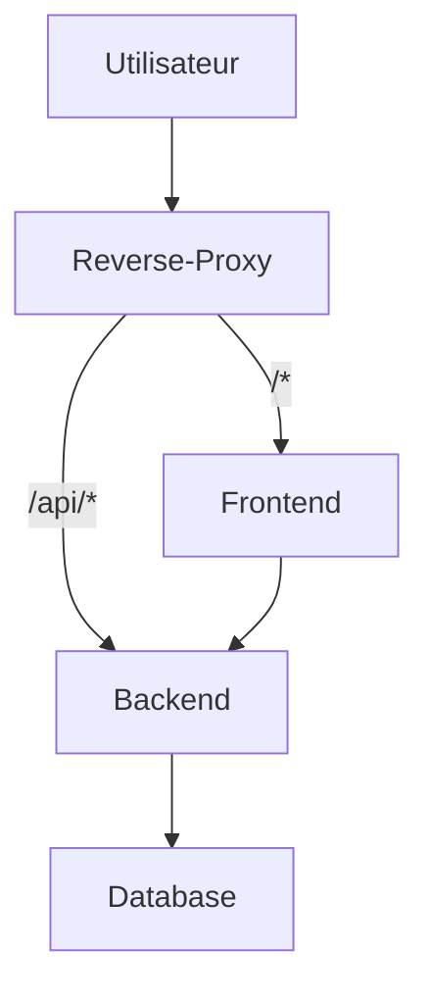
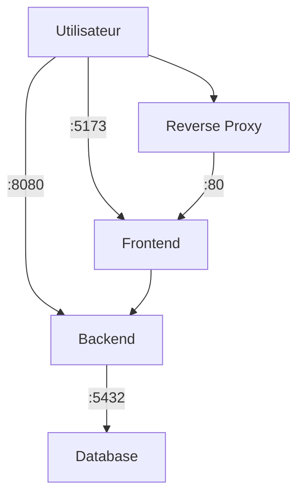

# Projet Docker

## 1. Architecture globale

Le projet est composé de trois parties principales :

1. Base de données `PostgreSQL` (service `db` dans `docker-compose.yml`).
2. API REST `Spring Boot` (service `api`) exposant des endpoints pour gérer des items et vérifier la santé du système.
3. Frontend `React + Vite` (dossier `webapp`) consommant l'API. En développement il tourne via le serveur Vite (port 5173). Une configuration Nginx (`webapp/nginx.conf`) est fournie pour un déploiement statique.

Le front et le back sont retourné via un reverse proxy `NGinx` (service `nginx`) qui redirige les requêtes vers l'API ou le frontend selon le chemin.

Réseau interne : <br>
L'API communique avec Postgres via le nom de service Docker `db`. La persistance des données est assurée par un volume Docker `pgdata`.

### Architecture de production


### Architecture de développement

## 2. Commandes pour builder et lancer

Se placer à la racine (là où se trouve `docker-compose.yml`).

Commande pour lancer en developpement :
```powershell
docker compose up -d --build
```

Commande pour lancer en production :
```powershell
docker-compose -f docker-compose.yml up --build -d
```

Arrêter et supprimer les conteneurs :

```powershell
docker compose down
```

Voir les logs :

```powershell
docker compose logs -f api
docker compose logs -f db
```

Rebuilder uniquement l'image backend si nécessaire :

```powershell
docker compose build api
```


## 3. Endpoints API

Back :
| Méthode | Endpoint | Description | Corps attendu |
|---------|----------|-------------|---------------|
| GET | `/api/health` | Vérifie la santé de l'API | - |
| GET | `/api/items` | Liste tous les items | - |
| POST | `/api/items` | Crée un nouvel item | `{"name": "<string>"}` |

Réponse `POST /api/items` : l'item créé (JSON).

Front : accessible via le reverse proxy Nginx à la racine `/`.

## 4. Problèmes rencontrés & solutions

Au cours du projet nous avons rencontré plusieurs défis techniques<br>

Front : <br>
Rédacrion du Dockerfile multi-stage pour builder l'application React avec Node.js puis servir les fichiers statiques avec Nginx. <br>
Apres quelques essais, le dockerfile a été amelioré afin qu'il soit fonctionnel et optimisé grace a la separation des phases build et runtime, avec la partie node et la partie nginx. <br>


## 5. Choix techniques & raisons

Docker du backend :

- Multi-stage Dockerfile: utilisation de `maven:3.9.9-eclipse-temurin-23-alpine` pour builder puis `eclipse-temurin:23-jre-alpine` pour exécuter. Réduit la taille finale et sépare build/runtime pour plus de sécurité.
- Caching Maven: copie de `pom.xml` avant `src/` afin de réutiliser le cache des dépendances entre builds quand le code change peu.
- Build sans tests dans l'image: `-DskipTests` pour accélérer le build d'image; les tests se lancent hors image.
- Lancement simple: `CMD ["java", "-jar", "app.jar"]` avec `EXPOSE 8080` pour documenter le port interne.
- Configuration par variables d'environnement: l'image ne contient pas de secrets; `SPRING_DATASOURCE_*` sont injectées via Compose.
- Orchestration Compose: service `api` dépend de `db` (`depends_on`), port publié configurable via `HOST_PORT`, et `restart: unless-stopped` pour la résilience locale.
- Tag d'image explicite `backend:1.0`: facilite l'identification et le versionnement local.

Docker du frontend :
- Multi-stage Dockerfile: utilise `node:18-alpine` pour générer l'image de build, puis `nginx:alpine` pour builder l'image finale. Réduit la taille et sépare build/runtime.
- Lancement simple: `CMD ["nginx", "-g", "daemon off;"]` pour build l'image avec Nginx.
- Variables d'environnement Vite: `VITE_API_BASE_URL` permet de configurer l'URL de l'API au runtime.
- Configuration Nginx: fichier `nginx.conf` personnalisé pour gérer le routage des requêtes vers l'API ou les fichiers statiques.
- Tag d'image explicite `frontend:1.0`: facilite l'identification et le versionnement local.

## 6. Variables d'environnement principales (`spring-api/.env`)

| Variable | Description | Exemple |
|----------|------------|---------|
| `POSTGRES_USER` | Utilisateur DB | `user` |
| `POSTGRES_PASSWORD` | Mot de passe DB | `password` |
| `POSTGRES_DB` | Nom base | `db` |
| `SPRING_DATASOURCE_URL` | URL JDBC | `jdbc:postgresql://db:5432/db` |
| `SPRING_DATASOURCE_USERNAME` | User JDBC | `user` |
| `SPRING_DATASOURCE_PASSWORD` | Password JDBC | `password` |
| `HOST_PORT` | Port publié pour l'API | `8080` |

## 7. Données initiales

Le fichier `data.sql` (si rempli) est exécuté au démarrage pour insérer des données dans la base.

## 8. Tests rapides des endpoints

```powershell
curl http://localhost:8080/api/health
curl http://localhost:8080/api/items
curl -X POST http://localhost:8080/api/items -H "Content-Type: application/json" -d '{"name":"Test"}'
```
